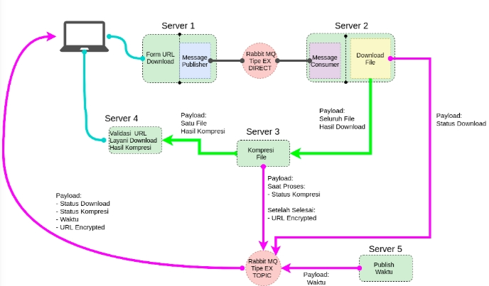

# Tugas Akhir
course: Layanan Aplikasi Web (LAW)

## Description
This project consists of 5 servers those communicate by RabbitMQ.

## Project Structure
- services/ -> modules to do certain activities
- static/ -> styling
- temp/ -> folder to hold downloaded and comrpessed files
- template/ -> layout
- config.py -> constant variables loaded from config.yaml
- config.yaml -> configuration file
- requirements.txt -> third-party modules
- server1.py, server2.py, server3.py, server5.py -> webservices of server 1, 2, 3, and 5.
- server4.conf -> NGINX configuration file for server 4.

## Architecture

## Technology Stack
- RabbitMQ
- Stomp.js
- Flask
- Nginx
- Bootstrap

## Reference
- https://www.cloudamqp.com/blog/2019-05-29-publishing-throughput-asynchronous-vs-synchronous.html
- https://www.cloudamqp.com/blog/2015-09-03-part4-rabbitmq-for-beginners-exchanges-routing-keys-bindings.html
- https://www.dev2qa.com/how-to-download-image-file-from-url-use-python-requests-or-wget-module/
- https://likegeeks.com/downloading-files-using-python/
- https://stackoverflow.com/questions/15644964/python-progress-bar-and-downloads

